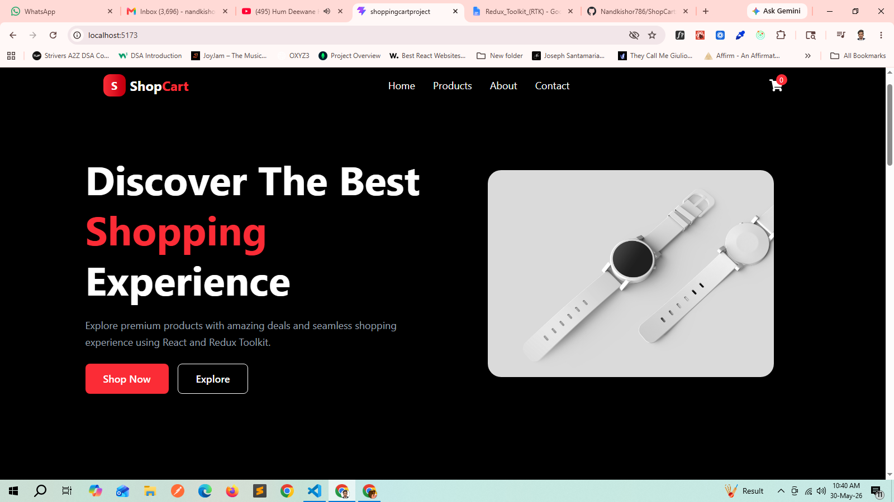
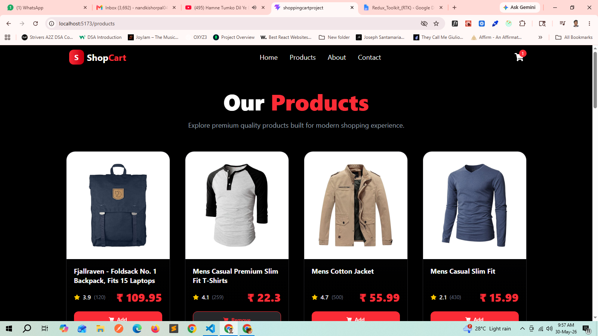
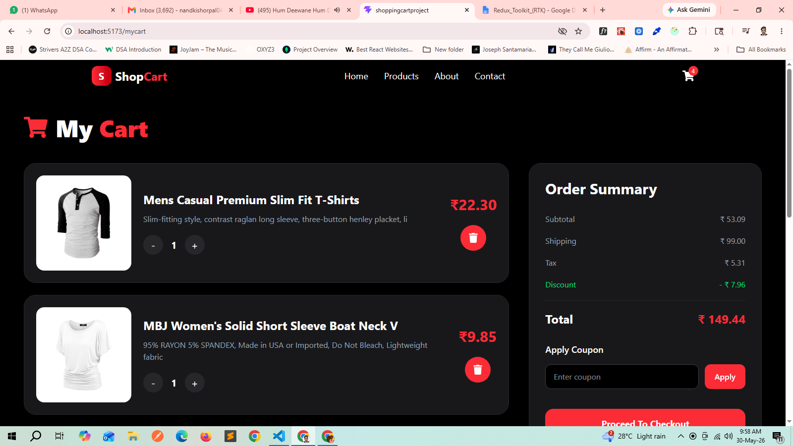
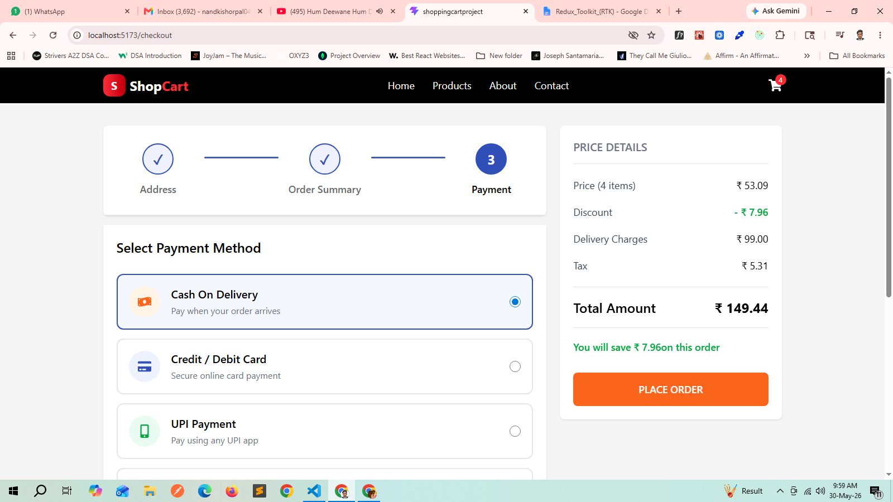
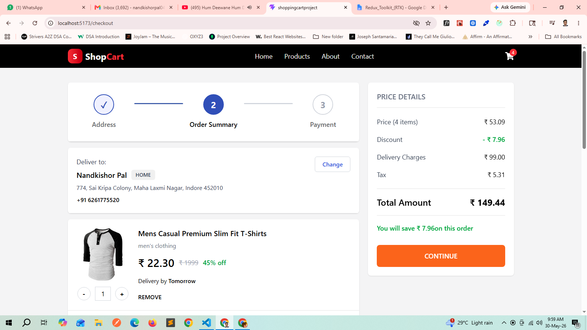
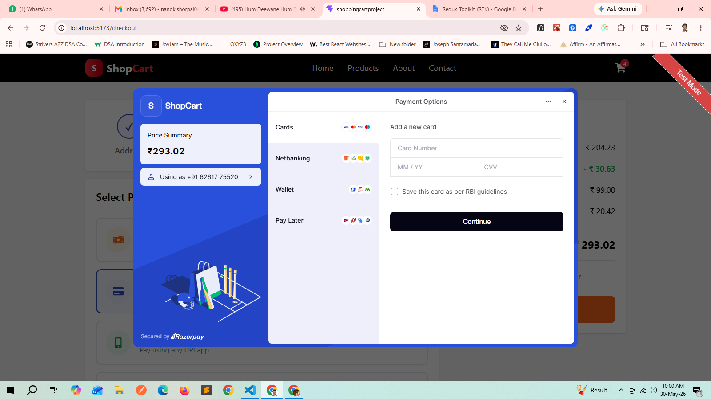
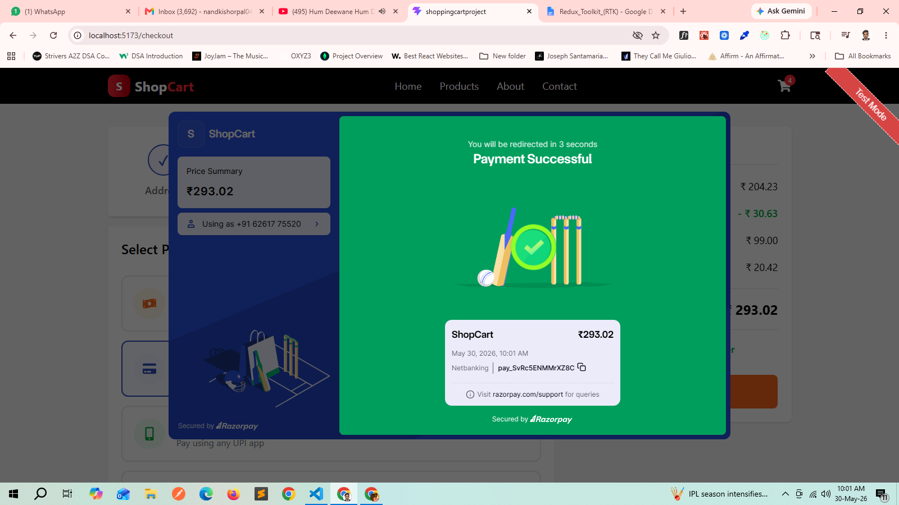
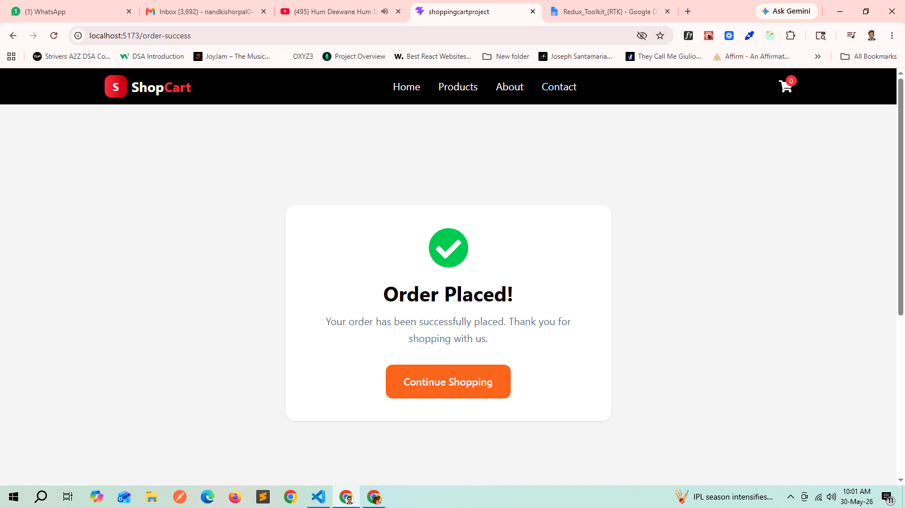

# 🛒 ShopCart – MERN E-Commerce Platform

ShopCart is a full-stack e-commerce web application built using the MERN Stack (MongoDB, Express.js, React.js, Node.js). The platform provides a modern online shopping experience with product browsing, cart management, secure checkout, and Razorpay payment integration.

---

## 🚀 Features

### Customer Features

* Browse products
* Search products
* Add products to cart
* Update product quantity
* Remove products from cart
* Dynamic cart calculations
* Multi-step checkout flow
* Delivery address section
* Payment method selection
* Cash On Delivery (COD)
* Razorpay Payment Gateway Integration
* Order success page
* Responsive design

### Payment Features

* UPI Payments
* Credit/Debit Cards
* Net Banking
* Wallet Payments
* Cash On Delivery (COD)

---

## 🛠️ Tech Stack

### Frontend

* React.js
* Redux Toolkit
* React Router DOM
* Tailwind CSS
* Axios
* React Toastify
* React Icons
* Vite

### Backend

* Node.js
* Express.js
* MongoDB
* Mongoose
* Razorpay
* dotenv
* CORS

### Database

* MongoDB Atlas

---

## 📂 Project Structure

```bash
ShopCart
│
├── frontend
│   ├── src
│   ├── public
│   └── package.json
│
├── backend
│   ├── config
│   ├── controllers
│   ├── routes
│   ├── models
│   ├── middleware
│   └── package.json
│
└── README.md
```

---

## ⚙️ Installation

### Clone Repository

```bash
git clone https://github.com/Nandkishor786/ShopCart.git
```

```bash
cd shopcart
```

---

### Frontend Setup

```bash
cd frontend
npm install
npm run dev
```

---

### Backend Setup

```bash
cd backend
npm install
npm run dev
```

---

 ## 🔑 Environment Variables

### Backend (.env)

```env
MONGO_URL=your_mongodb_connection_string

PORT=5000

CLIENT_URL=http://localhost:5173

RAZORPAY_KEY_ID=your_razorpay_key

RAZORPAY_SECRET=your_razorpay_secret
```

### Frontend (.env)

```env
VITE_API_URL=http://localhost:5000

VITE_RAZORPAY_KEY=your_razorpay_key
```

## 💳 Razorpay Integration

ShopCart uses Razorpay for secure online payments.

Supported payment methods:

* UPI
* Credit Card
* Debit Card
* Net Banking
* Wallets
* Cash On Delivery

---

## 🌐 Deployment

### Frontend

* Vercel

### Backend

* Render

### Database

* MongoDB Atlas

---

## 🔗 Live Demo

Frontend: https://your-vercel-url.vercel.app

Backend API: https://your-render-url.onrender.com


## 📸 Screenshots

### Home Page


### Product Page


### Cart Page


### Checkout - Order Summary


### Checkout - Payment Method


### Razorpay Payment Gateway


### Razorpay Payment Gateway


### Order Success Page



## 🎯 Future Improvements

* User Authentication (JWT)
* User Profile
* Order History
* Admin Dashboard
* Product Management
* Inventory Management
* Payment Verification
* Email Notifications
* Coupon System
* Wishlist

---

## 👨‍💻 Author

**Nandkishor Pal**

📧 [nandkishorpal0404@gmail.com](mailto:nandkishorpal0404@gmail.com)

🔗 LinkedIn: https://www.linkedin.com/in/nandkishor-pal

🔗 GitHub: https://github.com/Nandkishor786

---

⭐ If you like this project, don't forget to give it a star.
